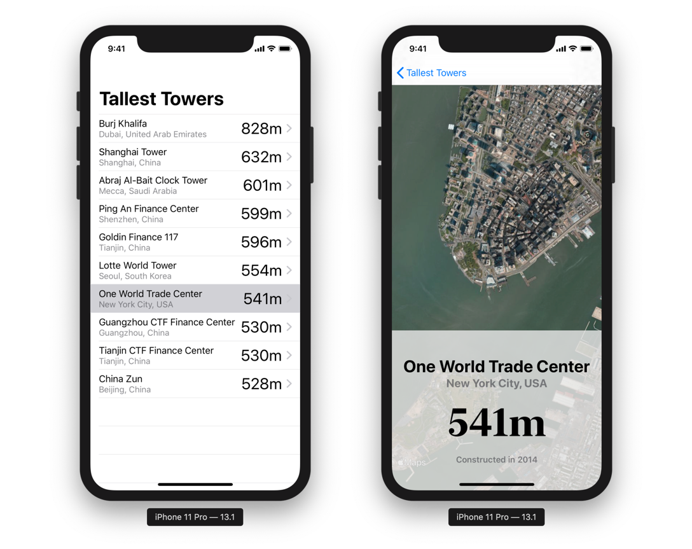
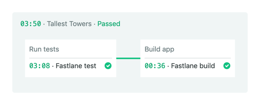

# Semaphore CI for iOS

This sample iOS application includes a basic CI pipeline demonstrating how to build and test an iOS app with [Semaphore CI](https://semaphoreci.com). This project requires Xcode 11.1 and is written in Swift 5.1 using SwiftUI.

## Running the sample app and tests locally

To run the sample application locally in Xcode, clone this repository and open `TallestTowers.xcodeproj`. Then, select an installed simulator and choose "Run" from the "Product" menu or press ⌘R.

The project also has both unit, and UI tests. To run all tests locally, choose "Test" from the "Product" menu or press ⌘U.  



To run the sample application on a real device you will need to configure the Xcode project to use your development team. Open `TallestTowers.xcodeproj` and set the development team for each of the `TallestTowers`, `TallestTowersTests`, and `TallestTowersUITests` targets as follows:

1. Select the `TallestTowers` project in the Project navigator.
2. Switch to the "Signing & Capabilities" tab.
3. Select each target in turn and select a valid development team in the "Signing" settings.

## Running the CI pipeline locally

To test the CI pipeline, you will need [fastlane](https://fastlane.tools) installed on your local machine. A sample `Fastfile` has been included in this project which is configured to:

1. Build the app with [`gym`](https://docs.fastlane.tools/actions/gym/).
2. Run the unit and UI tests.

To run the CI pipeline, execute the following commands from the project directory in Terminal:

```
bundle install --path vendor/gems
bundle exec fastlane build
bundle exec fastlane test
```

## Running the CI pipeline on Semaphore

To run the CI for this sample app on Semaphore, fork this repository and add it as a new project from [your Semaphore dashboard](https://id.semaphoreci.com/init_auth).

Semaphore pipelines are made up of blocks executed in sequence that are configured in a `.semaphore/semaphore.yml` file in the root of your project. The [pipeline configuration for this sample project](.semaphore/semaphore.yml) is fully commented, and has been configured to build the application and then run tests.

This sample Semaphore configuration uses an `a1-standard-4` machine running macOS Mojave with [Xcode 11.1, fastlane and other build tools pre-installed](https://docs.semaphoreci.com/article/162-macos-mojave-xcode-11-image). Other, larger machine types are [available if needed](https://docs.semaphoreci.com/article/20-machine-types). 

For more information on the full cabilities of the `semaphore.yml` configuration file, [see the documentation](https://docs.semaphoreci.com/article/50-pipeline-yaml). 



**Important Note:** If you receive the error message "Selected machine type is not available in this organization" after setting up this sample project on Semaphore, ensure your account is on the Semaphore Pro plan. A 14 day free trial of this plan is available from your dashboard.

## License

Copyright ©2019 Rendered Text – Distributed under the MIT License. See the [LICENSE](LICENSE) for full terms.
